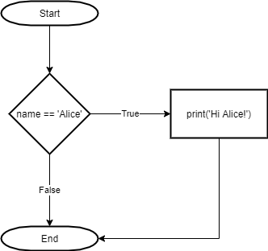

# Chapter 2 - Flow Control - Notes 
## Boolean Values
There are only two Boolean values `True` and `False`.  They do not have '' quotes around them, the first letter `T` and `F` are always capitalized, and the rest of the characters are always lowercase.  
They are used in expressions and can be stored in variables. 

## Comparison Operators
***Comparison operators* or *relational operators* compare two values and evaluate to a single Boolean value**.  That is to say that they evaluate to `True` or `False` . There are six in total: 

|Operator | Meaning|
|:--------|:-------|
|  `==` | equal to |
| `!=` | not equal |
| `>` | greater than |
| `<` | less than |
| `>=` | greater than or equal to |
| `<=` | less than or equal to |

NOTE: `==` and `!=` can be used on values of any data type. 

## Boolean Operators
There are three Boolean operators used to compare Boolean values. The three operators are `and`, `or`, and `not`. 

### Binary Boolean Operators
The two binanry Boolean Operators are `and` and `or`.  This means that they always take two Boolean values (or expressions). 

The `and` operator evaluates the expression to be `True` if both Boolean values are `True`.  
The `and` Operator's Truth Table
| Expression | Evaluates to... |
|:---------|:----------------|
|`True and True` | `True`   |
|`True and False`| `False`  |
|`False and True`| `False`  |
|`False and False`| `False` |

The `or` operator evaluates to `True` if *either* of the two Boolean values is `True`.  
The `or` Operator's Truth Table
| Expression | Evaluates to... |
|:-----------|:-----------------|
|`True and True` | `True`   |
|`True and False`| `True`  |
|`False and True`| `True`  |
|`False and False`| `False` |

### Unary Operator
The `not` operator only operates on one Boolean value.  It simple evaluates to the oposite Boolean value.  
The `not` Operator's Truth Table
| Expression | Evaluates to... |
|:-----------|:-----------------|
|`not True` | `False`   |
|`not False`| `True`  |

## Mixing Boolean and Comparison Operators
`and`, `or`, and `not` are called *Boolean operators* because they always operate on the Boolean values `True` and `False`.  

Examples:   
`>>>> 4 > 5             # This expression contains the Boolean operator >, therefore this expression will evaluate to a Boolean value True or False`  
`False                  # The expression is evaluated and is False.`  

`>>>> 4 < 5 and 5 < 6`  
`True`  

`>>>> 4 < 5 and 6 > 5`  
`False`  

`>>>> 1 < 2 or 2 > 1`  
`True`  

`>>>> 1 == 2 or 2 == 3`  
`Flase`  

The Boolean operators have an order of operations just like the math operators do. After math and comparison operators evaluate, Python evaluates the `not` operators first, then the `and` operators, and then the `or` operators. 

Example:  
`>>>> 2 + 2 == 4 and not 2 + 2 == 5 and 2 * 2 == 2 + 2      # math operators, then comparison operators, then boolean operators (not>and>or)`  
`True`  

## Flow Control Elements
Flow control statements start with a part called the *condition* and are always followed by a black of code called the *clause*.  

*Conditions* = expressions, the above examples are *conditions*.  Conditions are expressions just specific to flow control statements. Conditions always evaluate down to a Boolean value (`True` or `False`).   

A flow control statement decides what to do based on whether its condition is `True` or `False`, and almost every flow control statement uses a condition. 

*Blocks* of code - is a group of code.  The beginning of a block is denoted when the indentation is increased. There are three rules for blocks:
 1. Blocks begin when the indentation increases. 
 2. Blocks can contain blocks. 
 3. Blocks end when the indentation decreases to zero or to a containing blocks indentation. 

## Flow Control Statements
### *if* Statements
An `if` statement's clause (the block following the `if` statement) executes if the condition is `True`.  The clause is skipped if the condition is `False`.  An `if` statement consists of the following: 

- The `if` keyword. 
- A condition (an expression that evaluates to a Boolean value, `True` or `False`)
- A colon.
- Starting on the next line, an indented block of code (called the `if` *clause*).  

**All flow control statements end with a colon and are followed by a new block of code (the clause)**

### *else* Statements
An `if` clause can be followed by and `else` statement.  The `else` clause is only executed if the `if` statements condition is `False`. In English, "If this condition is true, execute this code. Or else, execute that code." An `else` statement doesn't have a condition. In code, and `else` statement always consists of the following: 

- The `else` keyword. 
- A colon. 
- Starting on the next line, an indented block of code (called the `else` clause).